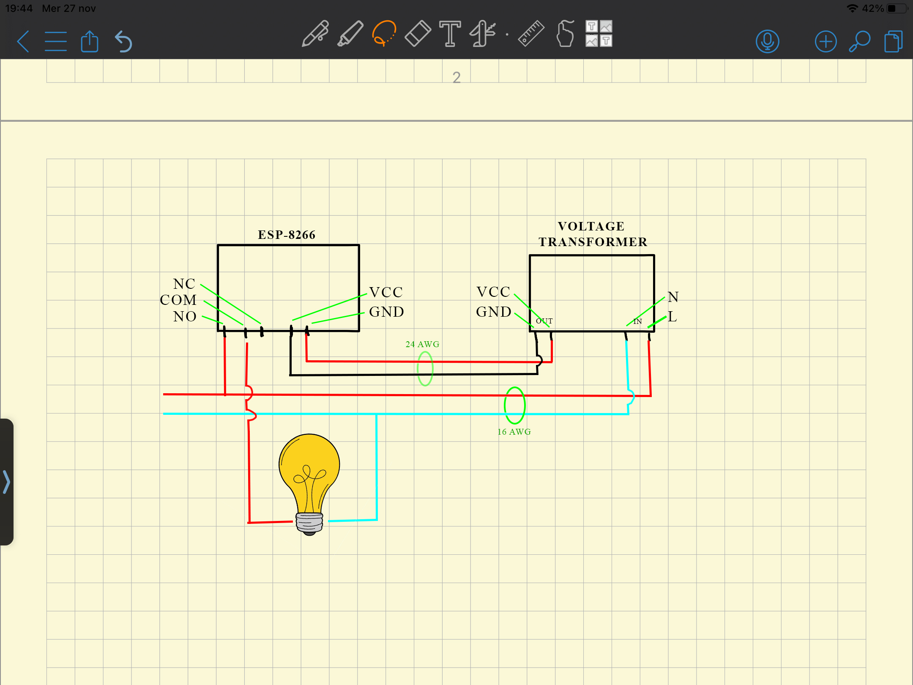

# smart-light
Simple method to make a light smart using the ESP8266

------------------------------------------------------------

# ESP-8266 Smart Light Controller 💡

Un progetto open-source per trasformare qualsiasi presa elettrica in un dispositivo smart controllabile via Wi-Fi, basato su ESP-8266 (ESP-01S).

## 🛠 Componenti Necessari

### Hardware

| Componente | Descrizione | Link d'acquisto (esempio) |
|------------|-------------|---------------------------|
| **ESP-8266 ESP-01S** | Modulo Wi-Fi con relè integrato, selezionare 'module esp01s' | [AliExpress](https://it.aliexpress.com/item/1005006770241321.html?spm=a2g0o.order_list.order_list_main.10.438b3696HzkLYm&gatewayAdapt=glo2ita) |
| **Adattatore USB-ESP01** | Programmatore per ESP-01S, selezionare 'ch340' | [Aliexpress](https://it.aliexpress.com/item/1005006532380532.html?spm=a2g0o.productlist.main.12.743eeeQXeeQXIC&aem_p4p_detail=20250325114612205898350556600001038579&algo_pvid=3dd618ca-987a-4333-8027-28605046bc9e&algo_exp_id=3dd618ca-987a-4333-8027-28605046bc9e-11&pdp_ext_f=%7B%22order%22%3A%227%22%2C%22eval%22%3A%221%22%7D&pdp_npi=4%40dis%21EUR%212.34%212.22%21%21%2117.93%2117.04%21%40210390c917429283727421109ecacf%2112000037553824021%21sea%21IT%21831238174%21X&curPageLogUid=sAJhvwVRT03e&utparam-url=scene%3Asearch%7Cquery_from%3A&search_p4p_id=20250325114612205898350556600001038579_3) |
| **Trasformatore 220V→5V** | Alimentazione per il circuito, selezionare '5V 700mA new' | [Aliexpress](https://it.aliexpress.com/item/1005006059965654.html?spm=a2g0o.order_list.order_list_main.5.438b3696HzkLYm&gatewayAdapt=glo2ita) |
| **Cavi elettrici** | 24 AWG (rosso/nero) e 16 AWG (marrone/blu) | [Aliexpress](https://it.aliexpress.com/w/wholesale-cavi-elettrici.html?spm=a2g0o.productlist.search.0) |

*Nota: I link sono esemplificativi - cercare i migliori prezzi attuali*

### Software
- Arduino IDE ([download ufficiale](https://www.arduino.cc/en/software)) ([Tutorial Youtube](https://www.youtube.com/watch?v=3kM3wmDkNvE))
- Librerie (installabili via Library Manager):
  - `ESP8266WiFi`
  - `ESP8266WebServer`
  - `EEPROM`

## 🔌 Schema dei Collegamenti

1. **Alimentazione**:
   - Collegare il trasformatore 220V→5V alla rete elettrica

2. **Collegamenti**:
   - Seguire perfettamente lo schema elettrico in figura (non mi assumo nessuna responsabilità delle vostre azioni, prestare molta attenzione)

3. **Sicurezza**:
   - Assicurarsi che tutti i collegamenti a 220V siano ben isolati
   - Verificare la polarità dei cavi prima di alimentare

## ⚙ Configurazione Iniziale

### 1. Programmazione del firmware
1. Collegare l'ESP-01S alla chiavetta USB seriale impostata in modalità programmazione
2. Aprire Arduino IDE e installare il supporto per ESP8266 (se non già presente) ([Tutorial Youtube](https://www.youtube.com/watch?v=OC9wYhv6juM))
3. Caricare lo sketch fornito (`sketch.ino`)
4. Verificare che la programmazione avvenga con successo

### 2. Configurazione Wi-Fi
1. Collegare il dispositivo alla corrente
2. Sul tuo smartphone:
   - Cerca la rete Wi-Fi chiamata "ESP-Switch"
   - Connettiti (non richiede password)
   - Attendere di vedere l'icona del Wi-Fi connessa prima di proseguire
3. Apri un browser e vai all'indirizzo: `192.168.4.1`
4. Segui la procedura guidata:
   - Seleziona la tua rete Wi-Fi dall'elenco
   - Inserisci la password della rete
   - Clicca "Connetti"

### 3. Ottenere l'IP del dispositivo
Dopo la connessione:
1. Il dispositivo mostrerà un messaggio con l'IP assegnato
2. In alternativa:
   - Accedi al router (tipicamente `192.168.1.1`)
   - Cerca nella lista dei dispositivi connessi quello chiamato "ESP-Switch"
   - Prendi nota dell'IP assegnato

## 📱 Utilizzo del Dispositivo

### Interfaccia Web
1. Dal browser, accedi all'IP del dispositivo (es. `192.168.1.100`)
2. Vedrai l'interfaccia di controllo con:
   - Pulsanti ON/OFF o Click (a seconda della configurazione)
   - Link alla pagina di configurazione
   - Opzione di reset completo

### Configurazione avanzata
Dalla pagina `/config` o dall'apposito pulsante puoi:
- Cambiare il nome del dispositivo
- Modificare il comportamento (ON/OFF o Click singolo)
- Personalizzare l'interfaccia

## ⚠ Sicurezza e Precauzioni
- Non toccare i componenti quando sono alimentati a 220V
- Verifica tutti i collegamenti prima di alimentare
- Utilizza un contenitore isolante per il circuito
- Non esporre il dispositivo a umidità o temperature estreme

## 🌍 Open Source License
Questo progetto è rilasciato con licenza MIT - completamente gratuito e open source. Sentiti libero di modificarlo, migliorarlo e condividerlo!

